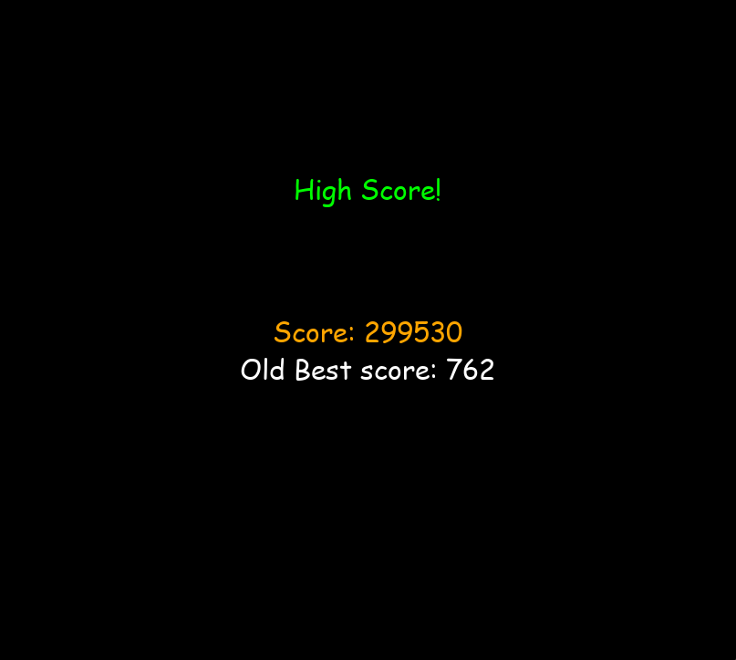

# Tetris in pygame
A fully sounded single Player Tetris game following the official Tetris Guidelines using pygame

## Required installation
```python
pip install pygame
```
## Running the Program
```python
py main.py
```

# Code Structure / Information
- Uses a stack system to manage the different states of the game.
  - Inspiration is based on how android studio works
- Uses an custom observer design pattern to handle UI widgets such as Buttons
- Button uses listeners to such as on_click, on_hover to handle different events


# Tetris Features
**Note:** The following features is based on the official Tetris Guidelines

Features:
- Game runs in 60 fps 
- 7 bag randomizer
  - Randomizer works by 
    - 1 - Generating a sequence of all seven Tetrominoes Shapes **permuted randomly** into a "bag" 
    - 2 - When a new Tetromino is needed, the Tetromino at the front of the bag will be taken out, pushing all others the Tetrominoes doward by one
    - 3 - Repeat step 1 when the bag reaches its minimum number of items allowed
- Ghost Piece
  - Indicate the position where the Tetromino will fall into 
- Hard Drop
  - Directly place the Tetromino onto the field where the Ghost Piece is
- Soft Drop
  - Speed up the fall of the Tetromino
- Uses the Super Rotational System for its rotation and wall kicks
  - This rotational system supports wall kicks and T-Spins
- DAS (Delayed Auto Shift)
  - Refers to be behaviour where the player hold Holds the left/right Key
    - The game will shift the falling Tetromino sideways, wait (Delay) for a certain milliseconds, and shift it repeatedly if the player continues holding the key (Autoshift). It will shift on every x milliseconds defined by the system.
  - Allows for smooth movements
- Lock Delay (Extended Placement Lockdown Mariation)
  - The number of frames a Tetromino waits while on a ground before "locking" to the Tetris field
  - Extended variation includes: the maximum number of moves a Tetromino can perform before a forced lockdown
- ARE (Appearance delay)
  - Interval between a "lockdown" of the current Tetromino and the generation and update of the next Tetromino
  - During this interval, player can still input events (Hard Drop, moving left/right etc.) before the first "fall" update of the next Tetromino
- Scoring system based on the official guidelines
- Levels with increasing speed curve 
  - Max level of 20 (can be changed by setting the MAX_LEVEL variables on the settings.py file)
  - Level increases by 1 for every 10 lines cleared (Fixed goal system)
  - Time spent per row in milliseconds = (0.8-((Level-1)*0.007))^(Level-1)
  - Note that since the game runs in 60 fps, the absolute lowest time spent per row in seconds that can be run is 1/60 seconds
- Display the next 5 Tetrominoes from the bag on the screen
- Hold Piece functionality
- Game Over conditions:
  - Lock out: a whole Tetromino lockdown above the Skyline
  - Block out: Part of a newly-generated Tetromino is blocked by an existing block on the field
---


# Application usage
When the app is fist opened, you will be given three options to select:
 - Play (Play a tetris game)
 - High Score (Show high scores statistics on the respective game modes)
 - Quit

<table>
  <tr>
    <td>Main Menu Screen</td>
     <td>Button Animation</td>
  </tr>
  <tr>
    <td></td>
    <td></td>
  </tr>
 </table>

A menu ost will be played in the background. There are also different sounds effects when the button is clicked or hovered

## Play Menu
There are 4 game modes you can choose from
- Marathon (Achieve a high score over a series of levels)
- Zen (Practice mode)
- Sprint (Clear 40 lines quickly)
- Ultra (Clear as many lines as possible within a time limit)

The program will also display the hint description for each mode when you hover the respective buttons.


<table>
  <tr>
    <td>Marathon </td>
     <td>Zen</td>
  </tr>
  <tr>
    <td></td>
    <td></td>
  </tr>
    <tr>
    <td>Sprint </td>
     <td>Ultra </td>
  </tr>
  <tr>
    <td></td>
    <td></td>
  </tr>
 </table>
<table>

## Tetris Game
This is the main screen for the Tetris Game

Only the relevant information will be displayed based on the game modes. Below are the examples of the screen for Marathon and Ultra Mode respectively


<table>
  <tr>
    <td>Marathon </td>
     <td>Ultra </td>
  </tr>
  <tr>
    <td></td>
    <td></td>
  </tr>
 </table>

The red lines indicates the "SkyLine". Tetrominoes will initially  spawn just above this SkyLine.


The main Tetris Ost "Korobeiniki" will be played in the background since it is required by the Tetris Guidelines. There are also different sfx for differenct actions that you make such as rotating or moving the piece.

According to the Guidelines, there should be a countdown of 3 seconds before the game can be played. You can set this by setting **WITH_COUNTDOWN = True** on settings.py. The default is set to False.


## Game over Screen
This state will be displayed when the game over condition [Look at Tetris Featires Section] is met.

In this State, your relevant statistics will be displayed on the screen and will be compared with your old best statistics.


<table>
  <tr>
    <td>Not High Score</td>
     <td>High Score</td>
  </tr>
  <tr>
    <td></td>
    <td></td>
  </tr>
 </table>

A different sound will be played depending if you have achieve a new high score or not.

Your score will be saved if it is a new high score

## High Score Screen

On this State, your game statistics will be displayed based on the game mode.


You can reset the high scores by clicking on the "clear" button


---

# Controls
**Left Arrow Key** : Move the Tetromino to the left

**Right Arrow Key** : Move the Tetromino to the Right

**UP Arrow Key, X** : Rotate Clockwise

**Z, LCTRL, RCTRL** : Rotate Counter-Clockwise

**Down Arrow Key** : Soft Drop

**Space** : Hard Drop

**C, LSHIFT, RSHIFT** : Hold

**Esc** : Exit the current state

**M** : Toggle Mute Sounds


---


# Links

## **Rules and Special Systems**

Tetris Guidelines Wiki: https://tetris.fandom.com/wiki/Tetris_Guideline

Official Tetris Guidelines: https://www.dropbox.com/s/g55gwls0h2muqzn/tetris%20guideline%20docs%202009.zip?dl=0 


Rotation System: https://tetris.wiki/Super_Rotation_System

Score System:  https://tetris.fandom.com/wiki/Scoring#Guideline_scoring_system  


## **Sounds**

SFX: https://you.have.fail/at/tetrioplus/#sfx-25Pi25-soundpack

Main Ost: https://archive.org/details/TetrisThemeMusic

Menu Ost: https://www.zophar.net/music/gameboy-gbs/tetris

Game Over Ost:https://downloads.khinsider.com/game-soundtracks/album/tetris-rip 
